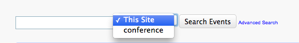
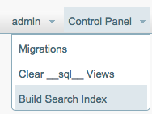
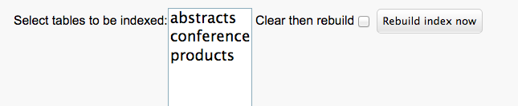
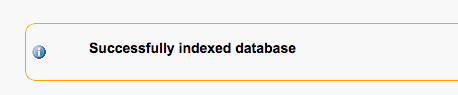
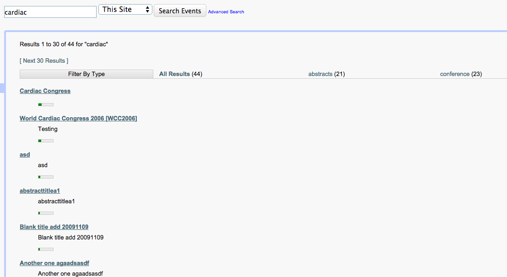

#Xataface Full-Site Search

Xataface supports an optional full-site, full-text search that allows the user to search multiple tables at once in the top search box.

##Activating Full-Text Search

1. Add a `[_index]` section to your app's conf.ini file.
2. For each table that you wish to be searchable in the full-site search, add a line to the `[_index]` section as follows:
 
 ~~~
 table_name=1
 ~~~
 E.g. If you wanted the `conferences`, and `products` tables to be searchable, your `[_index]` section would look like:
 
 ~~~
 [_index]
    products=1
    conferences=1
 ~~~
 If you load your app you should notice that there is now a select list beside the top search box:
  
 
 
 However if you perform a search with "Site" selected, you will get no results.  This is because you need to perform an initial build for the search index.
3. When you first activate full-site search, you need to manually build the index.  Log into your app as a user who has the "manage" permission.  Under the "Control Panel" menu in the upper right, you should have an option to *build search index*. 
  
 
 
 Select this option.
 
4. This will display a form to rebuild the search index as shown here:
 
 
 
 Select the tables that you want to index, then click the "Index" button.  Upon completion it should display a success message:
 
 

5. Now, you can try to perform a search.  Here is a sample result page for a search in my application for the phrase "cardiac":
 
 
 
 Some things to notice here:
    
    * At the top, the results are categorized to show from which table the matches were found.
    * You can filter the results to show only the ones from a particular table, by clicking on the appropriate header.
    * A "relevance" meter is shown for each match.  This is pulled from the MySQL full-text index.

##Fuzzy Matching / Finding Misspellings

As of Xataface 2.1.2, the full-site search will now match misspellings.  For example, if we modify the search from the above example for "cardiac", and instead search for "crdiac", we will receive the same results. 

**How it works**:

Xataface automatically adds the soundex codes for each word in a record's searchable text, to the record's searchable text.  This makes it possible to search the index for soundex codes as well as the actual content.  [Soundex](http://en.wikipedia.org/wiki/Soundex) is a phonetic algorithm for indexing names by sound, as pronounced in English. Since misspellings of words often produce the same soundex code as the original word, this works well for finding matches on queries even when words are misspelled.

##How the Site Search Works

The Xataface full-site search leverages MySQL's fulltext search functionality to be able to sort matches by relevance.  When the site search is enabled, it causes all records to be "indexed" when they are saved through Xataface.  It also provides a mechanism to clear and re-index the database manually.  "Indexing" a record involves generating a corresponding record into the `dataface__index` table, which is a private table created automatically by Xataface to house the index for the site search. The structure of this table is as follows:

~~~
CREATE TABLE `dataface__index` (
  `index_id` int(11) NOT NULL AUTO_INCREMENT,
  `table` varchar(64) NOT NULL,
  `record_id` varchar(255) NOT NULL,
  `record_url` varchar(255) NOT NULL,
  `record_title` varchar(255) NOT NULL,
  `record_description` text,
  `lang` varchar(2) NOT NULL,
  `searchable_text` text,
  PRIMARY KEY (`index_id`),
  UNIQUE KEY `record_key` (`record_id`,`lang`),
  FULLTEXT KEY `searchable_text_index` (`searchable_text`)
) ENGINE=MyISAM AUTO_INCREMENT=314 DEFAULT CHARSET=utf8
~~~

When a user performs a search using the *Site Search* feature, it queries against the full-text index on the `searchable_text_index` column.  The results page makes use of the `record_title`, `record_url`, and `record_description` for displaying the results.  All of these values are stored at the time that a record is indexed (which happens automatically when the record is saved), and they can all be customized implementing delegate class methods.

The relevant code for indexing is limited to only a few classes and actions:

1. **[The Dataface_Index](../Dataface/Index.php) class** - Includes code for creating the index and for querying the index.
2. **[The Build Index Action](../actions/manage_build_index.php)** - The manager action for rebuilding the index manually.
3. **[The Index Search Action](../actions/manage_build_index.php)** - The action to actually search the index.

##Customizing Site Search

###Customizing Searchable Text

The full-site search works by indexing all of the records in the designated tables (i.e. the tables listed in the `[_index]` section of your conf.ini file), and this entails creating a record in the `dataface__index` table.  Actual user searches are performed by matching the user query against the MySQL full-text index that resides in the `searchable_text` column of this table.  By default, Xataface uses the concatenation of all text (i.e. `CHAR`, `VARCHAR`, `TEXT`, etc..) field values as the searchable text for a record.

> **WARNING** : Full-site search indexes all char/text fields in a record by default irrespective of the field permissions.  If you have fields that should not be "findable" in a search, you should override the searchable text to only include the data that you want to be searchable.

You can override the searchable text for each record by implementing the `getSearchableText()` method in your table's delegate class. E.g.

~~~
function getSearchableText(Dataface_Record $record){
    return $record->strval('some_field').' '.$record->strval('other_field');
}
~~~

###Customizing Search Results 

**Title & Description**:

The search results will show a "title" and "description" for each record matched by the search.  You can customize these values by implementing the `getTitle()` and `getDescription()` methods respectively in your table's delegate class.

e.g.

~~~
function getTitle(Dataface_Record $record){
    return $record->display('event_name');
}

function getDescription(Dataface_Record $record){
    return $record->display('event_description');
}
~~~

If you don't implement these methods, Xataface will make a best guess at which fields should be used for these values.

**Link:**

The search results also include a link to the record.  By default this will link to the *view* tab of the record.  However this can be overridden using Xataface's delegate methods for link generation.  It actually uses the `Dataface_Record::getPublicLink()` method for generating the link.  You can override this value by implementing `getPublicLink` in your table's delegate class:

~~~
function getPublicLink(Dataface_Record $record){
    return df_absolute_url(DATAFACE_SITE_URL.'/path/to/my/record');
}
~~~

**Template:**

If you need more customization than can be achieved via the title, description, and link options mentioned above, you can also override the entire [search results template](../Dataface/templates/Dataface_Search_Results.html) by copying it into your application's `templates` directory and customizing it to suit your needs.

###Changing Order In Search Select List

By default, the "Site Search" option is selected in the top search menu.  That means that, if the user just types in a search word and hits enter, they will be shown the results for the multi-table search instead of the normal single-table search.  If you want to change this, you can simply override the `search_index` action and change its `order` directive.

E.g.  In your app's `actions.ini` file:

~~~
[search_index > search_index]
    order=99
~~~

