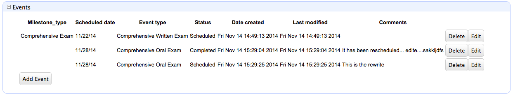

#Xataface Portlet Component

The Portlet component allows you to include a data-table with the results of an SQL query inside an existing page or action.  It will optionally include "Add", "Edit", and "Delete" buttons that will allow you to modify the data set.  The "Add" and "Edit" actions will open in a jQuery dialog using the [RecordDialog](RecordDialog.md) component.

##Requirements

Xataface 2.1.3 or higher (or latest in GitHub).

##Source

**PHP Component:**

If you are working in PHP, you will access it through the [xf\components\Portlet](../../xf/components/Portlet.php) class.  It wraps the [Porlet](../../js/xataface/components/Portlet.js) Javascript component.

**Javascript Component:**

You can also use the [Porlet Javascript component](../../js/xataface/components/Portlet.js) directly from Javascript

**HTML Template:**

The PHP component renders the portlet using the [Portlet.html](../../Dataface/templates/xataface/components/Portlet.html) template.  Check it out to see what it expects to get.  

##Code Example

The following example shows a section implemented inside a table [delegate class](../DelegateClasses.md) to display a portlet inside the *view* tab of a record.

    // Includes at beginning of file
    require_once 'xf/components/Portlet.php';
    use xf\components\Portlet;
    
    
    // sections_xxx method
    function section__events(Dataface_Record $record){
        $portlet = Portlet::createPortletWithQuery(
            array(
                '-table' => 'career_events',
                'student_number' => '='.$record->val('student_number'),
                'career_type' => '='.$record->val('career_type'),
                'career_number' => '='.$record->val('career_number')
            ),
            array(
                'milestone_type',
                'scheduled_date',
                'event_type',
                'status',
                'date_created',
                'last_modified',
                'comments'
            ),
            array(
                'cssClass' => '',
                'canEdit' => true,
                'canAdd' => true,
                'canDelete' => true,
                'rowActions' => 'test_portlet_actions',
                'params' => array(
                    'student_number' => $record->val('student_number'),
                    'career_type' => $record->val('career_type'),
                    'career_number' => $record->val('career_number'),
                    '-xf-hide-fields' => 'student_number career_type career_number'
                ),
                'addButtonLabel' => 'Add Event'
            )
        );
        $content = $portlet->toHtml();
        return array(
            'label' => 'Events',
            'class' => 'main',
            'content' => $content,
            'order' => 5
        );
    }
    
The resulting portlet will look like:

Some notes on this example:

1. This uses the `createPortletWithQuery` static generator, which takes a Xataface query array, and will use `df_query()` internally to load records.  You could also use `createPortletWithSQL` which allows you to pass in an SQL query instead.  You can also just use the constructor which takes rows and columns that you have already loaded using some other method.
2. This uses the `canEdit`, `canDelete`, and `canAdd` options to make sure that the *edit*, *add*, and *delete* buttons will be displayed.
3. The `params` configuration option adds GET parameters that are passed to the new and edit record forms when they are displayed.  In this case, I am passing default values to the `student_number`, `career_type`, and `career_number` fields, and using the `-xf-hide-fields` GET parameter (new in Xataface 2.1.3) to make sure that those fields' widgets are set to be hidden.

##Usage

1. Imports
   
   ~~~
   require_once 'xf/components/Portlet.php';
   use xf\components\Portlet;
   ~~~
2. Create Portlet:

 ~~~
 $portlet = Portlet::createPortletWithQuery(
    $query, // A Xataface query associative array
    $columns, // An array of column names to display - null for all
    $options, // An associative array of configuration options passed to Portlet
 ~~~
3. Display portlet:

 ~~~
 $content = $portlet->toHtml();
 ~~~
    
TODO:  MORE DOCUMENTATION ON THE OPTIONS

For now, check out the [xf\components\Portlet](../../xf/components/Portlet.php) source code for information about available options.

##Configuration Options

| Key | Description | Required | Default | Since |
|---|---|---|---|---|
| `table` | Name of the table that this portlet shows. | No | Value of `-table` directive in query. | 2.1.3 |
| `cssClass` | CSS Classes to add to the HTML table. | No |  | 2.1.3 |
| `canEdit` | Boolean value indicating whether *edit* buttons should be included with each row. | No | `false` | 2.1.3 |
| `canAdd` | Boolean value indicating whether *add* button should be incldued. | No | `false` | 2.1.3 |
| `canDelete` | Boolean value indicating whether *delete* buttons should be included with each row. | No | `false` | 2.1.3 |
| `rowActions` | Optional actions category from which to build row actions buttons. | No | `null` | 2.1.3 |
| `newParams` | Associative array of query parameters to be sent to the new record form of the record dialog when adding new records. | No | null | 2.1.3 |
| `params` | Associative array of query parameters to be sent to both new record and edit record forms when adding or editing records. | No | null | 2.1.3 |
| `addButtonLabel` | A custom label for the *add* button. | No | "Add Record" | 2.1.3 |
| `decorateRow` | An anonymous function to be called on each row data object before rendering.  The allows you to customize output or attach additional data. | No | `null` | 2.1.3 |
| `secure` | Whether to use Xataface permissions to determine whether *edit*, *delete*, and *add* buttons should be displayed. | No | `false` | 2.1.3 |    